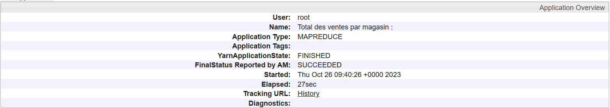

# ****Explications****
### **CONFIGURATIONS**

La première chose à faire est de récupérer les images docker fourni dans le tp, de créer le réseau qui permettra de relier les trois contenaires (réexpliquer après).

Après ça il faut créer les trois contenaires qui permettront d'exécuter le job mapReduce. Le master et les deux slaves :

    $ docker run -itd --net=hadoop -p 50070:50070 -p 8088:8088 -p 7077:7077 \
    -p 16010:16010 \
    --name hadoop-master --hostname hadoop-master \
    totofunku/bigdata-cours:latest

    $ docker run -itd -p 8040:8042 --net=hadoop \
    --name hadoop-slave1 --hostname hadoop-slave1 \
    totofunku/bigdata-cours:latest

    $ docker run -itd -p 8041:8042 --net=hadoop \
    --name hadoop-slave2 --hostname hadoop-slave2 \
    totofunku/bigdata-cours:latest``

Il est maintenant possible de rentrer dans notre conteneur master depuis lequel nous pourrons lancer nos jobs : 

`$ docker exec -it hadoop-master bash`

### **Lancer hadoop et yarn**

Avec le script présent dans le cluster :  `./start-hadoop.sh`

Et on peut voir nos deux " slaves " qui sont connectés au réseau de notre cluster créé précédemment avec: `$ docker network create --driver=bridge hadoop`
Ce réseau permet de relier entre eux notre master et nos deux slaves.

Ici le "master" va coordonner le travail de plusieurs deux "slaves".
Les "slaves" quant à eux vont executer les tâches de calcul et vont transmettre leurs états au "master".

Sur ce screenshot on voit que notre cluster est lancé est prêt à l'emploi sur : _http://localhost:50070_
### **LOCAL**
**Configurations**

!! Necessaire d'utiliser jdk1.8 sinon ça marche pas !!

Avant d'exécuter le code en local, il faut créer une configuration de type Application (Run->Edit Configurations...->+->Application).

_Et définir comme Main Class: tn.bigdata.tp1.WordCount, et comme Program
Arguments: src/main/resources/input/file.txt src/main/resources/output_

**Input en test local :** 

**Output en test local :** 

## **Avec Docker**

Tout d'abord, il est nécessaire de créer une configuration Maven avec la ligne de commande: `mvn package install` et de lancer celle ci.

Un fichie.jar est créé, on peut alors utiliser `docker cp target/wordcount-1.jar hadoop-master:/root/wordcount-1.jar` pour copier le fichier .jar créé dans le contenaire master.

## ****Commandes docker :****

###**Remplir son cluster HDFS**:

Pour traiter de la donnée, il nous faut de la donnée dans notre cluster.

Pour cela _nous allons utiliser le fichier purchases.txt comme entrée pour le traitement
MapReduce,_
et le charger dans le répertoire input que nous devons créer pour pouvoir préciser à notre job où le trouver.

Créer le répertoire :  `$ root@hadoop-master:~# hdfs dfs –mkdir -p input`

Charger le fichier à l'intérieur du repertoire (et donc du cluster): `root@hadoop-master:~# hdfs dfs –put purchases.txt input`

### **Préparer notre job :**

Après avoir lancé la configuration dans le terminal et copié le .jar avec :

_`docker cp target/wordcount-1.jar hadoop-master:/root/wordcount-1.jar`_

Revenir sur docker pour lancer le job: 

`   hadoop jar wordcount-1.jar tn.bigdata.tp1.ventesTotal input output2`

Il est important de préciser la classe qu'on veut exécuter, ici 'ventesTotal' ainsi que le dossier d'entré et de sortie.

(Il est également important de vérifier que le répertoire de sortie n'est pas déjà existant sinon il faudra veiller à le supprimer avec : `hdfs dfs -rm -r output`.)

**Résultats de la commande :** 

**Fichier de sortie :** 

Il faut utiliser la commande  `hadoop fs -tail
output2/part-r-00000` car le fichier de sortie se trouve bien dans le cluster HDFS.

Toutes les sommes ont bien été calculées

**Sur le ressource manager Hadoop (master) :** 

On voit bien ici nos deux applications dont celle que j'ai rajouté : _Total des ventes par magasin_.
On voit alors que le déploiement s'est bien déroulé et que l'exécution s'est déroulée sans problème.

# ****Détails du code****

_Écrire un Job Map Reduce permettant, à partir du fichier purchases initial, de déterminer le
total des ventes par magasin._

###**venteMapper**

    public class venteMapper extends Mapper<Object, Text, Text, DoubleWritable>{
    private Text magasin = new Text();
    private DoubleWritable cout = new DoubleWritable();

        public void map(Object key, Text value, Context context)
                throws IOException, InterruptedException {
            String[] words = value.toString().split("\t");
            if (words.length >= 4) {
                try {
                    double costValue = Double.parseDouble(words[4]);
                    magasin.set(words[2]);
                    cout.set(costValue);
                    context.write(magasin, cout);
                } catch (NumberFormatException e) {
                    System.err.println("Erreur de conversion du coût : " + e.getMessage());
                }
            }
        }
    }

Ici chaque ligne d'entrée est divisée en mots grace au délimiteur que l'on a défini sur 'tabulation' ('\t'), que l'on stock ensuite dans un tableau de mots.

Puis on extrait deux informations dont on a besoin, ici le **_nom du magasin_** (index 2) et le **_cout_** (index 4).
C'est donc l'association clef-valeur avec la clef étant le nom du magasin et la valeur étant le cout.

Enfin on écrit cette paire clef-valeur dans la sortie.

### **venteReducer**

    import java.io.IOException;

    public class venteReducer extends Reducer<Text, DoubleWritable, Text, DoubleWritable> {

        private DoubleWritable total = new DoubleWritable();

        public void reduce(Text key, Iterable<DoubleWritable> values, Context context)
                throws IOException, InterruptedException {
            double sum = 0.0;
            for (DoubleWritable value : values) {
                System.out.println("value: "+value.get());
                sum += value.get();
            }
            total.set(sum);
            System.out.println("--> Sum = "+sum);
            context.write(key, total);
        }
    }

C'est ici l'étape dite de 'réduction'.

La fonction '_reduce_' va itérer sur chacune des clefs et la variable '_sum_' va stocker la somme des valeurs rattachées aux clefs.
Ces sommes sont ensuite stockés dans l'objet '_total_'.

Le résultat final (la clé du magasin et la somme totale des coûts) est écrit dans le fichier de sortie.

### **ventesTotal**

    public class ventesTotal {
        public static void main(String[] args) throws Exception {
            Configuration conf = new Configuration();
            Job job = Job.getInstance(conf, "Total des ventes par magasin :");
            job.setJarByClass(ventesTotal.class);

            job.setMapperClass(venteMapper.class);
            job.setReducerClass(venteReducer.class);

            job.setOutputKeyClass(Text.class);
            job.setOutputValueClass(DoubleWritable.class);

            FileInputFormat.addInputPath(job, new Path(args[0]));
            FileOutputFormat.setOutputPath(job, new Path(args[1]));

            System.exit(job.waitForCompletion(true) ? 0 : 1);
        }
    }

C'est ici qu'on configure et execute le job mapReduce.

On définit nos instances et les classes utilisées pour le mapper et le reducer ainsi que les entrées et sorties.

Et voilà ! On vient d'appliquer et de conteneuriser un job mapReduce !